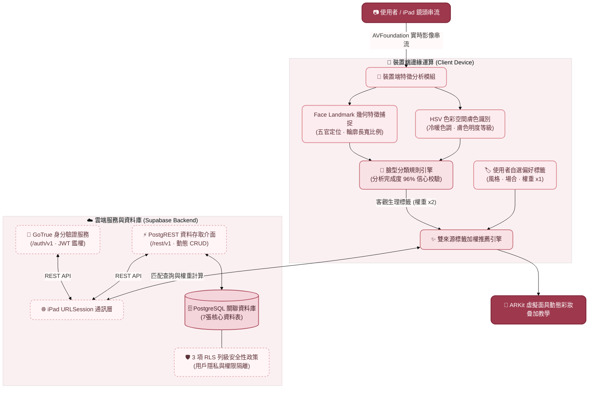

# BlushNote：基於動態臉部辨識之美妝 AR 教學系統

> **指導教授**：劉譯閔 教授  
> **專案小組成員**：盧恩佳、洪語欣、廖冠筑、簡偉玲  
> **個人核心職責**：演算法原型研發與驗證、雲端資料庫架構設計 (Supabase / RLS)、雙來源加權推薦邏輯、專案進度管理

---

## 📌 專案背景與核心價值
針對美妝新手對自身臉型特徵認知不足、妝容選品決策成本高及化妝步驟缺乏即時反饋等痛點，本專案開發 iPad 原生美妝引導應用 **BlushNote**。系統結合裝置端臉部特徵分析演算法、個人化加權推薦模型與 AR 即時步驟疊加引導，打造兼顧個人隱私與互動體驗的美妝學習方案。

---

## 🏗️ 系統總體架構 (System Architecture)

系統採用**「邊緣運算特徵解析 ＋ 雲端微服務解耦」**架構，落實隱私優先原則：

---

## 🎬 實機操作動態展示 (Live Application Demos)

系統介面以優雅溫和的視覺體驗為核心，結合流暢的帳號驗證、邊緣端即時人臉分析與專屬瀑布流推薦：

| 01. 帳號註冊與個人設定 | 02. 即時人臉分析與標籤推薦 | 03. 快速登入與專屬推薦主頁 |
| :---: | :---: | :---: |
|  |  |  |
| **流暢註冊與個人設定** • 電子郵件與密碼安全檢查 • 建立使用者暱稱與個人化帳號 • 串接 Supabase GoTrue 鑑權 | **智慧檢測與特徵標籤** • 光線與臉部角度即時提示 • 幾何特徵點計算臉型 (鵝蛋臉) • HSV 膚色色調判定 (暖色調/健康) • 雙來源特徵標籤即時比對 | **專屬個人化美妝首頁** • 快速登入鑑權與狀態同步 • 依照加權匹配分數動態排序 • 瀑布流瀏覽專屬推薦妝容 |
